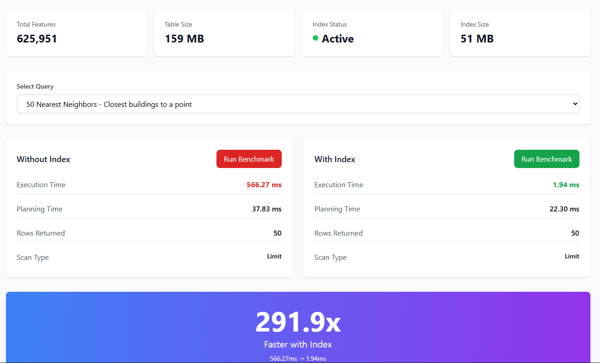

# Spatial Query Performance Optimization

**Comprehensive spatial indexing analysis with multiple implementation patterns**

[](http://spatial-query-perf.s3-website.eu-north-1.amazonaws.com/)
[](docs/technical-blog.md)
[](LICENSE)

> Demonstrating 14x to 292x query speedup through PostGIS spatial indexing on 625k+ features



## Project Overview

This project combines a client-side spatial indexing demo for instant interaction with a real PostgreSQL/PostGIS benchmarking pipeline for evidence-backed performance results. It is designed to show the same indexing principles in multiple ways:
- Client-side demo (RBush) with curated scenarios for repeatable comparisons
- PostgreSQL/PostGIS benchmarks with EXPLAIN ANALYZE timings and query plans
- Benchmarking UI to run queries with/without GiST indexes

**Key Achievement:** Reduced query time from 566ms to 1.94ms (292x speedup)

## Performance Results

| Query Type | Without Index | With Index | Speedup |
|------------|---------------|------------|---------|
| Small Bounding Box | 108.38 ms | 7.72 ms | **14x** |
| Count in Area | 138.06 ms | 11.45 ms | **12x** |
| Distance Filter | 667.33 ms | 3.75 ms | **178x** |
| 50 Nearest Neighbors | 566.27 ms | 1.94 ms | **292x** |

## Features

- Client-side demo for instant interaction (RBush)
- PostgreSQL benchmark suite with EXPLAIN ANALYZE plan capture
- Interactive Benchmarking API with real-time query execution
- Query plan analysis and index management for accurate testing
- Live dashboard showing side-by-side performance comparison
- 6 query patterns covering bbox, distance, KNN, and more
- 625k+ features from OpenStreetMap

## Tech Stack

- **Backend:** FastAPI, SQLAlchemy, psycopg2
- **Database:** PostgreSQL 15 + PostGIS 3.4
- **Frontend:** React, Tailwind CSS
- **Data Processing:** GeoPandas, Shapely
- **Infrastructure:** Docker, Docker Compose

## Project Structure

```
Spatial-Query-Performance-Optimization/
|-- benchmarks/          # PostgreSQL/PostGIS analysis + evidence
|   |-- scripts/         # Data loading and processing
|   |-- queries/         # SQL queries to benchmark
|   |-- results/         # Summary report and artifacts
|   `-- data/            # Data sources (not committed)
|-- frontend/            # Benchmark UI (API-driven)
|-- backend/             # FastAPI (optional)
|-- docs/                # Documentation and diagrams
|-- docker-compose.yml   # PostgreSQL + PostGIS
`-- requirements.txt     # Python dependencies
```

## Quick Start

Choose your path:
- Instant interaction: open the live client-side demo (no setup).
- Evidence-backed benchmarks: run the PostgreSQL/PostGIS pipeline below.

### Prerequisites
- Docker and Docker Compose
- Python 3.10+
- Node.js (for frontend dev)

### 1. Clone the Repository
```bash
git clone https://github.com/James-Ngei/Spatial-Query-Performance-Optimization.git
cd Spatial-Query-Performance-Optimization
```

### 2. Start PostgreSQL + PostGIS
```bash
docker compose up -d
```

### 3. Install Python Dependencies
```bash
python3 -m venv venv
source venv/bin/activate  # On Windows: venv\Scripts\activate
pip install -r requirements.txt
```

### 4. Load Data
```bash
# Download Nairobi buildings (155MB GeoJSON)
osmium extract -b 36.7,-1.35,36.9,-1.2 buildings.osm.pbf -o nairobi_buildings.osm.pbf
osmium export nairobi_buildings.osm.pbf -o nairobi_buildings.geojson

# Load to PostGIS
python scripts/load_simple.py
```

### 5. Start the API
```bash
uvicorn backend.main:app --reload
```

API will be available at http://localhost:8000

### 6. Open the Dashboard
```bash
cd frontend
python3 -m http.server 3000
```

Dashboard at http://localhost:3000

## Live Demo
[Interactive demo](http://spatial-query-perf.s3-website.eu-north-1.amazonaws.com/) - client-side RBush simulation for instant interaction. Uses curated query scenarios (not purely random) so comparisons stay repeatable.

## Real PostgreSQL Benchmarks
The performance analysis was conducted on PostgreSQL + PostGIS with 500k+ OSM features. Evidence is documented in:
- `benchmarks/results/summary-report.md` for measured timings and speedups
- `benchmarks/queries/queries.py` for the SQL patterns
- `benchmarks/benchmark_runner.py` for EXPLAIN ANALYZE runs
- `benchmarks/scripts/` for data loading and setup

## Why Two Implementation Patterns?

- **PostgreSQL (Local):** Real benchmarks, actual GiST indexes, production patterns
- **Client-side demo:** Instant interaction, no database hosting, concept visualization

Best of both worlds: approachable learning plus evidence-backed measurements you can reproduce locally.

The demo uses RBush (JavaScript R-tree) to show the same algorithmic principles that GiST indexes use in PostgreSQL.

## API Endpoints

```bash
# List available queries
GET /api/queries

# Get table statistics
GET /api/stats

# Run benchmark
POST /api/benchmark
{
  "query_id": "small_bbox",
  "use_index": true
}

# Create/drop spatial index
POST /api/index/create
POST /api/index/drop

# Check index status
GET /api/index/status
```

## Query Patterns

### 1. Small Bounding Box (14x speedup)
```sql
SELECT osm_id, building, name
FROM buildings
WHERE geometry && ST_MakeEnvelope(36.82, -1.29, 36.84, -1.27, 4326)
```
**Use case:** Map tile loading, viewport queries

### 2. Distance Filter (178x speedup)
```sql
SELECT osm_id, building, name
FROM buildings
WHERE geometry && ST_Expand(ST_MakePoint(36.82, -1.29), 0.005)
AND ST_Distance(geometry, ST_MakePoint(36.82, -1.29)) < 0.005
ORDER BY ST_Distance(geometry, ST_MakePoint(36.82, -1.29))
LIMIT 100
```
**Use case:** Nearby features search

### 3. K-Nearest Neighbors (292x speedup)
```sql
SELECT osm_id, building, name,
       geometry <-> ST_MakePoint(36.82, -1.29) as dist
FROM buildings
ORDER BY dist
LIMIT 50
```
**Use case:** Find N closest features

## Key Learnings

### Understanding GiST Indexes
- **R-tree Structure:** Hierarchical organization by bounding boxes
- **Logarithmic Search:** Eliminates 99%+ of rows immediately
- **Operator Support:** `&&`, `<->`, `@>`, etc. all leverage the index

### Query Optimization Patterns
1. **Always use bounding box pre-filter** (`&&` operator)
2. **Two-stage filtering** (bbox -> exact predicate)
3. **KNN operator** (`<->`) for nearest neighbor
4. **Avoid geography casting** when planar distance is acceptable

### When Indexes Help Most

Good fits:
- Small area queries (< 10% of data)
- Distance-based searches
- K-nearest neighbor
- Map tile loading

Poor fits:
- Full table scans (>40% of rows)
- Very small tables (<10k rows)

## Dataset Details

- **Source:** OpenStreetMap (Geofabrik extract)
- **Region:** Nairobi, Kenya (bounding box: 36.7 E to 36.9 E, -1.35 N to -1.2 N)
- **Features:** 625,951 buildings
- **Geometry Types:** MultiPolygon (312,876), LineString (312,879), Point (196)
- **Table Size:** 159 MB
- **Index Size:** 51 MB (32% overhead)

## Configuration

### PostgreSQL Tuning
```sql
-- For optimal performance
shared_buffers = 256MB
work_mem = 64MB
max_connections = 200
```

### Benchmark Settings
```python
# Disable bitmap scans for fair comparison
SET enable_bitmapscan = off;  # Without index only
SET enable_indexscan = off;   # Without index only
```

## Documentation

- [Technical Blog Post](docs/technical-blog.md) - Deep dive into spatial indexing
- [API Documentation](http://localhost:8000/docs) - Interactive Swagger docs

## Contributing

Contributions welcome! Areas for improvement:
- [ ] Add more query types (buffer, union, intersection)
- [ ] Compare GiST vs SP-GiST vs BRIN indexes
- [ ] Test with larger datasets (5M+ features)
- [ ] Add frontend charts with Chart.js
- [ ] Implement query caching analysis

## License

MIT License - see [LICENSE](LICENSE) file

## Author

**James Ngei**
- Portfolio: [yourportfolio.com](https://james-ngei.github.io)
- GitHub: [@yourusername](https://github.com/James-Ngei)
- LinkedIn: [Your Name](https://linkedin.com/in/james-ngei-61461b1a5)

## Acknowledgments

- OpenStreetMap contributors for the data
- PostGIS team for excellent spatial database extensions
- Geofabrik for OSM extracts

---

**Star this repo if you found it helpful!**
